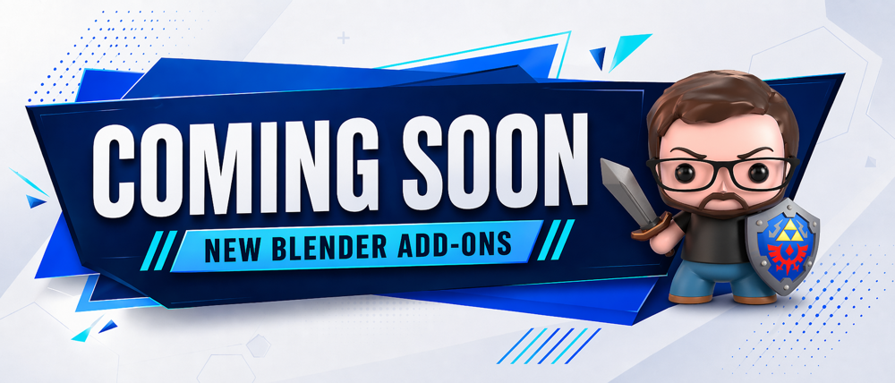
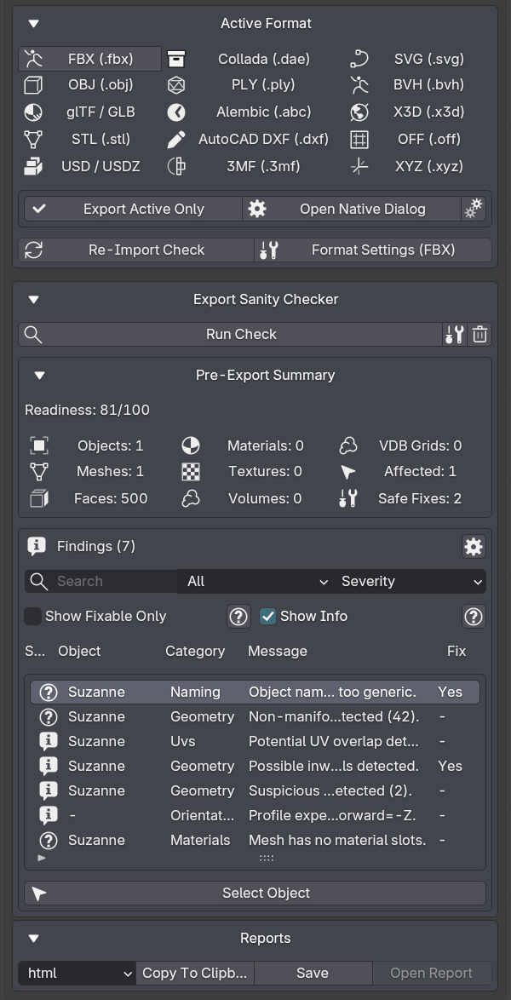
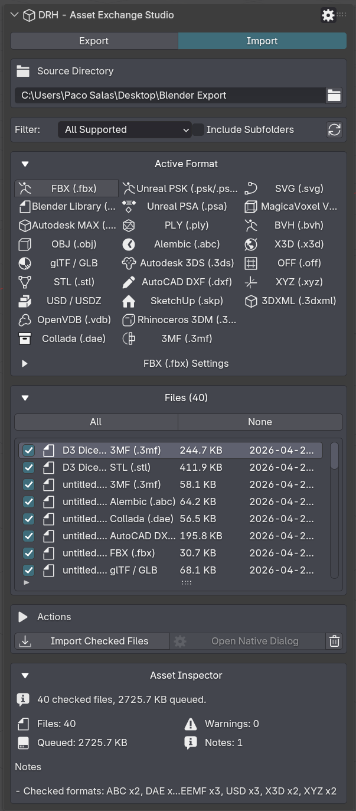
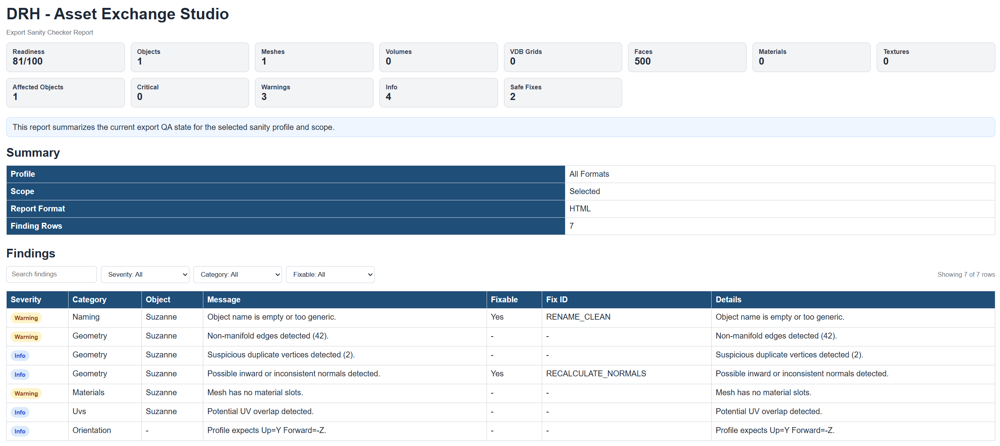

  

 

# DRH - Asset Exchange Studio

### Public Support Hub · Documentation · Feedback · Pre-release Validation

**A Blender utility for importing, exporting, validating, previewing, and batch-processing multi-format 3D assets.**

 

**Part of the DRH Add-ons ecosystem — Blender tools, updates, and releases.**

<!--

-->

---

**DRH - Asset Exchange Studio** helps Blender users import, export, validate, inspect, preview, and batch-process 3D assets across supported file formats and production workflows.

This repository is the central public hub for support, documentation, issue tracking, compatibility feedback, and community validation before marketplace release.

---

  
<strong>📚 Table of Contents</strong>

## Menu

- [Overview](#overview)
- [Media preview](#media-preview)
- [What DRH - Asset Exchange Studio does](#what-drh---asset-exchange-studio-does)
- [Supported formats](#supported-formats)
- [Key features](#key-features)
- [Full feature list](#full-feature-list)
- [Who is it for?](#who-is-it-for)
- [Current status](#current-status)
- [Feedback wanted before release](#feedback-wanted-before-release)
- [Quick links](#quick-links)
- [Before you post](#before-you-post)
- [Where to post](#where-to-post)
- [Support policy](#support-policy)
- [Technical notes](#technical-notes)
- [Availability](#availability)
- [Documentation](#documentation)
- [License](#license)

---

## Overview

**DRH - Asset Exchange Studio** is a Blender workflow utility designed to help users import, export, validate, inspect, preview, and batch-process 3D assets across multiple production formats.

It is intended for technical artists, asset creators, game artists, pipeline-focused users, BlenderKit creators, and teams that need cleaner asset exchange, local file handling, batch processing, format-based workflows, or repeatable import/export preparation.

Instead of managing asset transfers manually across folders, formats, naming conventions, validation steps, and delivery requirements, DRH - Asset Exchange Studio helps make asset exchange more organized, traceable, and production-friendly.

## Media preview

<!--

  

-->

<!--

---

### Demo video

Replace `YOUTUBE_VIDEO_ID` with your real YouTube video ID.

Example:
https://www.youtube.com/watch?v=YOUTUBE_VIDEO_ID

  
   
  Click the image to watch the demo on YouTube.

-->

<!--
### Quick demo GIF

Recommended size: 1280x720 or 960x540.

  

-->

### Early Screenshots

| Export Formats and Presets | Export Sanity Checker and Reports |
|---|---|
|  |  |

  
<strong>More Screenshots...</strong>

| Import Formats and File Queue | HTML Export QA Report
 |
|---|---|
|  |  |

-->

<!--
### Visual preview

Use this section if you want one large image instead of a gallery.

  

-->

<!--
Temporary placeholder while media is not available.

Media preview coming soon.

-->

---

## What DRH - Asset Exchange Studio does

DRH - Asset Exchange Studio helps you prepare, validate, import, export, preview, inspect, and batch-process asset data across supported formats inside Blender.

It is not only a simple import/export shortcut. It is designed as a workflow helper for format-based asset exchange, asset handoff, file preparation, local organization, validation steps, inspection, previews, and repeatable production-oriented transfer processes.

Use it to:

- Import assets using supported file formats
- Export assets using supported file formats
- Prepare assets for cross-format workflows
- Validate assets before handoff or packaging
- Preview and inspect asset data during exchange workflows
- Organize local file and path-based asset workflows
- Batch-process multiple assets when applicable
- Use pipeline presets for common delivery workflows
- Reduce repetitive manual import/export preparation
- Support more consistent asset transfer between tools or environments
- Improve pipeline clarity for asset creators and technical users

---

## Supported formats

DRH - Asset Exchange Studio is built around format-based asset exchange workflows.

The formats below are grouped by workflow type to make import/export support easier to scan before release.

---

### Export formats

#### Core 3D formats

#### Scene and pipeline formats

#### CAD, vector, motion, and data formats

---

### Import formats

#### Core 3D formats

#### Scene and pipeline formats

#### CAD, architecture, and DCC formats

#### Game, voxel, motion, volume, and data formats

---

### Format support notes

- Export and import format availability may depend on Blender version, installed dependencies, operating system, or format-specific requirements.
- Some formats may support import only, export only, or different levels of feature support.
- Format-specific behavior should be tested with real production files before marketplace release.
- Pipeline presets may enable different format combinations depending on the selected delivery workflow.

---

### Key Features

- Multi-format 3D import and export from one production panel
- Pipeline presets for 3D print, ArchViz, Marketplace, Web, Unreal, Unity, and Godot delivery
- Batch-oriented asset exchange for repeated handoff workflows
- Validation tools to catch issues before transfer or delivery
- Asset inspection and round-trip checking for safer conversions
- Directory-based import workflow with format filtering and collection routing
- Marketplace and asset-library preparation workflows
- Broad format coverage with platform-aware runtime handling

---

  
<strong>🧩 Full feature list</strong>

## Full feature list

### Multi-Format Exchange

- Unified import and export workflow
- Format-aware exchange pipeline
- Local file-based processing
- Format-specific availability handling

### Supported Formats

| Content Creation & Exchange | Game Engine & Animation Pipelines | CAD, Design & Fabrication | Specialized Data Formats |
|---|---|---|---|
| - FBX | - PSK | - MAX | - OpenVDB |
| - BLEND | - PSA | - STL | - SVG |
| - OBJ | - BVH | - USD / USDZ | - VOX |
| - glTF / GLB | - Alembic | - DXF | - OFF |
| - DAE | - 3DS | - SKP | - XYZ |
| - PLY | - X3D | - 3DM | - 3DXML |
|  |  | - 3MF |  |

### Export Workflow

- Output directory selection
- Enable or disable export formats
- Active export format switching
- Format-specific export option panels
- Cleanup and transform handling
- Path mode controls

### Import Workflow

- Source directory selection
- Refresh import file list
- Toggle checked files
- Clear file list
- Import checked files
- Native import fallback flow
- Supported-format filtering
- Include subfolders
- Collection routing to current collection
- Collection routing to scene collection
- Collection routing per file
- Collection routing to a custom collection

### Pipeline Presets

- 3D Print preset
- ArchViz Exchange preset
- General Delivery preset
- Godot preset
- glTF Web preset
- Marketplace preset
- OBJ General preset
- Unreal Engine preset
- Unity preset
- Auto-apply preset workflow
- Sync sanity profile
- Sync enabled formats
- Sync import workflow

### Validation & Inspection

- Asset inspection reports
- Round-trip validation
- Re-import check settings
- Scene metrics review
- Object metrics review
- Material metrics review
- Texture metrics review
- Delivery-oriented sanity profiles

### Batch & Handoff

- Batch export workflow
- Repeated handoff preparation
- Marketplace delivery preparation
- Asset-library preparation
- Client delivery cleanup workflow

---

## Who is it for?

DRH - Asset Exchange Studio is designed for:

- Technical artists
- Blender asset creators
- Game artists
- Pipeline-focused users
- Environment artists
- Marketplace asset creators
- BlenderKit creators
- Small teams and solo creators
- Users managing repeated import/export tasks
- Users preparing asset packs, libraries, or deliverables
- Users working with format-based asset exchange
- Users who need cleaner asset transfer, validation, inspection, and handoff workflows

---

## Current status

| Item | Details |
|---|---|
| **Status** | 🟣 In Development |
| **Current version** | 1.0.0 |
| **Minimum Blender version** | 4.2.0 |
| **Platforms** | Windows x64 |
| **Release type** | In development before public marketplace release |
| **Support repository** | [DRH Asset Exchange Studio Support](https://github.com/pacosalasv/DRH_Asset_Exchange_Studio-Support) |

This add-on is currently in development. Compatibility feedback, usability comments, feature expectations, and workflow suggestions are welcome before public release.

---

## Feedback wanted before release

This repository is open for public feedback before marketplace release.

Feedback is especially welcome on:

- Feature usefulness
- Supported import formats
- Supported export formats
- Format-specific workflow expectations
- Format validation requirements
- Import workflow expectations
- Export workflow expectations
- Batch-processing workflow needs
- Asset validation needs
- Local file handling expectations
- Path-based workflow requirements
- Pipeline preset ideas
- Marketplace or asset library preparation needs
- Pipeline and handoff requirements
- Compatibility concerns
- Installation experience
- Documentation clarity
- Expected pricing
- Marketplace expectations

Useful feedback examples:

> “I need `.fbx`, `.obj`, and `.glb` export for game-ready assets.”

> “I need `.3dm`, `.skp`, and `.3ds` import for architecture-related workflows.”

> “This should validate missing textures before export.”

> “I need batch export options for multiple assets and formats.”

> “This would be useful if it helps organize marketplace-ready asset packages.”

> “The workflow should clearly show which formats are supported for import and export.”

> “Format-specific presets would make this more useful for game engines and asset stores.”

---

## Quick links

- [Support repository](https://github.com/pacosalasv/DRH_Asset_Exchange_Studio-Support)
- [Ask a question in Discussions](https://github.com/pacosalasv/DRH_Asset_Exchange_Studio-Support/discussions)
- [Open a new issue](https://github.com/pacosalasv/DRH_Asset_Exchange_Studio-Support/issues/new/choose)
- [Report a bug](https://github.com/pacosalasv/DRH_Asset_Exchange_Studio-Support/issues/new?template=bug_report.yml)
- [Request a feature](https://github.com/pacosalasv/DRH_Asset_Exchange_Studio-Support/issues/new?template=feature_request.yml)
- [Report a compatibility issue](https://github.com/pacosalasv/DRH_Asset_Exchange_Studio-Support/issues/new?template=compatibility_issue.yml)

---

## Before you post

Please include as much of the following information as possible:

- Add-on version
- Blender version
- Operating system
- Installation method
- Clear steps to reproduce
- Expected result
- Actual result
- Error message, screenshot, or console output when available

For compatibility issues, please also include:

- Blender build type, if known
- Portable or installed Blender version
- Whether the issue happens with a clean Blender configuration
- Asset type or format involved, if relevant
- Import or export direction
- Import format used
- Export format used
- Local path structure, when safe to share
- Whether the issue involves file access, validation, missing files, asset transfer, format conversion, batch-processing, or path handling

---

## Use Discussions for

- Questions
- How-to topics
- Installation help
- Compatibility checks
- FAQ
- Suggestions
- Pre-release feedback
- Pricing feedback
- Workflow ideas
- Format support requests
- Pipeline use-case discussions

---

## Use Issues for

- Confirmed bugs
- Reproducible compatibility problems
- Format-specific import/export problems
- Feature requests
- Regressions
- Marketplace or listing-related problems
- Documentation errors

---

## Where to post

Open a **Discussion** for:

- General questions
- Setup help
- Workflow advice
- Suggestions
- Early feedback
- Format support requests
- Pipeline workflow ideas

Open an **Issue** for:

- Confirmed bugs
- Reproducible compatibility problems
- Import/export failures
- Format-specific problems
- Regressions
- Feature requests
- Documentation problems

---

## Support policy

This repository is a public support hub.

Do not post:

- Private account details
- License keys
- Payment information
- Confidential production files
- Private client files
- Sensitive system information

If a private file is required to reproduce an issue, please describe the problem first and wait for further instructions.

---

## Technical notes

This add-on is source based, with:

- No obfuscation
- No external services
- No account requirements

Local file access may be used for:

- Import workflows
- Export workflows
- Format-based asset exchange
- Asset transfer
- Asset validation
- Asset inspection
- Local validation reports
- Local file handling
- Path-based workflows
- Asset package preparation
- Project or asset folder selection
- Batch-processing workflows

The add-on is intended to work locally inside Blender.

Current package notes:

- Minimum Blender version: 4.2.0
- Platform currently indicated in package metadata: Windows x64
- Format support may depend on Blender version, available import/export operators, bundled dependencies, and operating system support

---

## Availability

This add-on may be available through multiple marketplaces and storefronts after release.

This GitHub repository remains the central public location for:

- Support
- Documentation
- Issue tracking
- Compatibility reports
- Public feedback
- Release notes

---

## Documentation

- [User Manual](docs/manual/user-manual.pdf)
- [Changelog](CHANGELOG.md)

---

## License

This repository is distributed under **GPL-3.0-or-later**.

---

### DRH Add-ons

**Blender tools, updates, and releases.**

Built for clean workflows, practical utilities, and production-friendly Blender setups.

